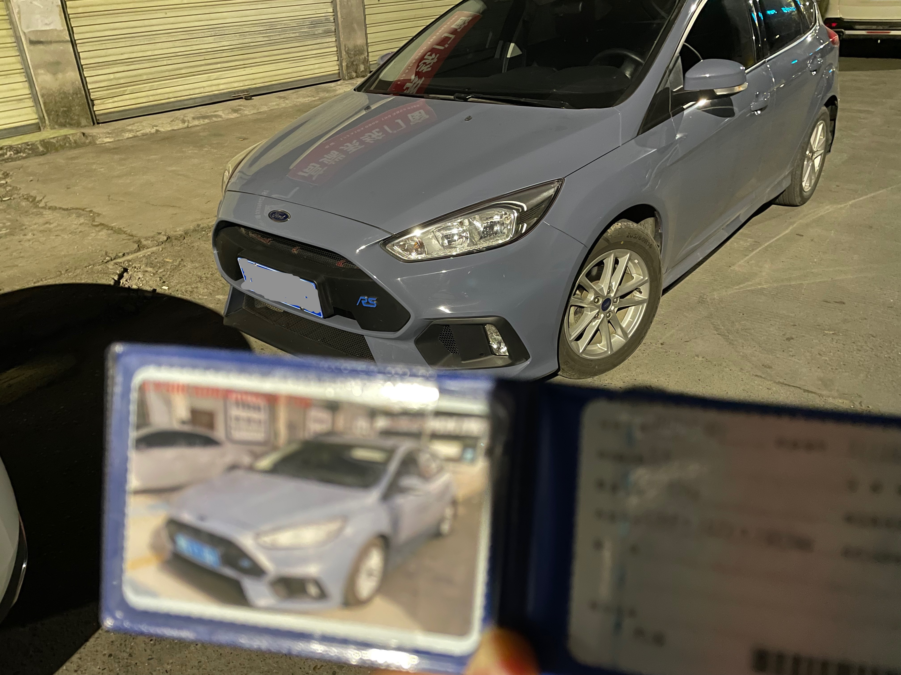
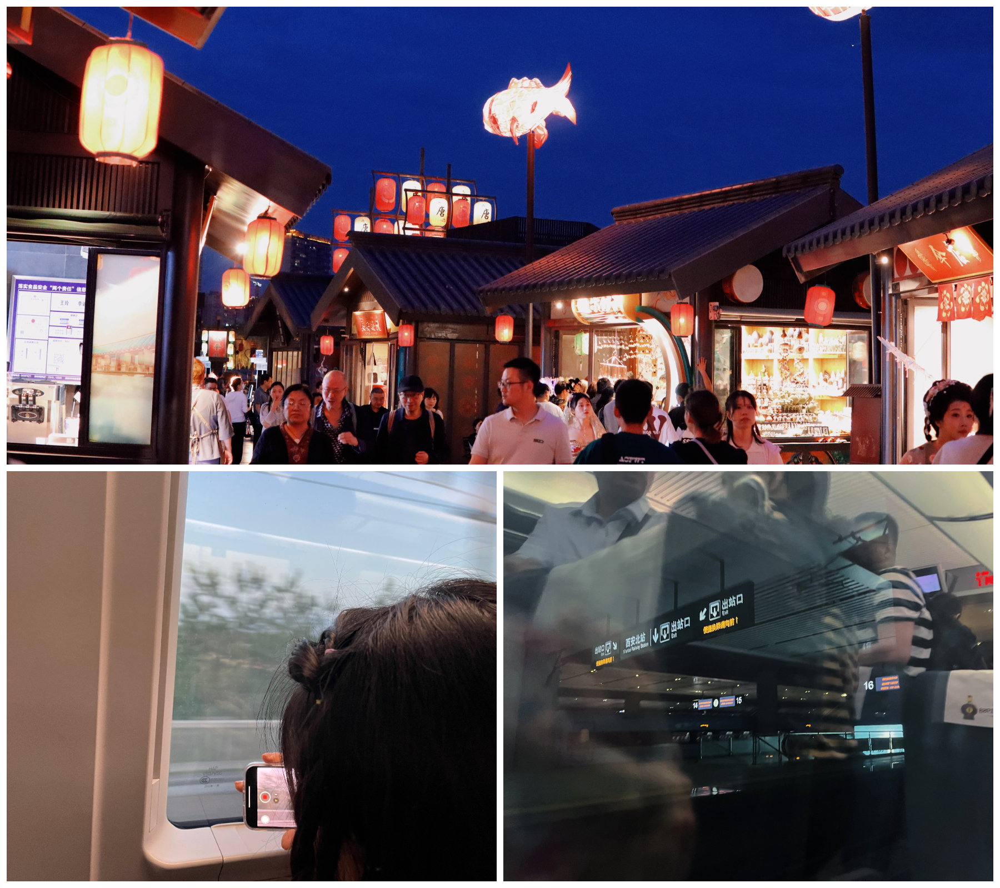
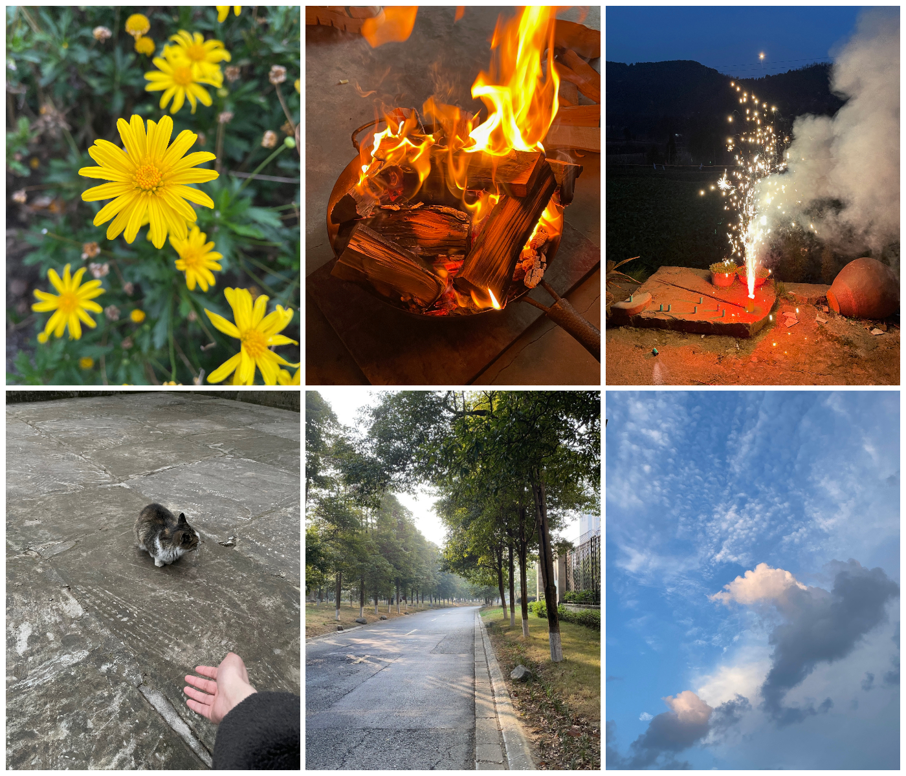

就。。。很久没有发过文章了，水一篇证明我还在，从上次裁员的文章到现在时间跨度也挺久的！

我从拿了驾照以后一直想买一辆车，然后改成自己喜欢的样子，但是我上班生活方式的原因，其实车子对我来说并不重要甚至是累赘。

上班通勤开车完全不如坐地铁，还不堵，停车也是个麻烦事，车位紧张还贵，平时自己出去玩的也少，所以虽然想要，但是一直没买，直到我去年🐑了以后心态发生了变化😂。

去年疫情开放还是啥来着忘了，身边很多人都🐑了，我自己也中招了，当时🐑了以后自己一个人在成都的出租屋躺着很难受，心里也很慌，然后就想着天天上班是为了啥，万一真的有啥事人直接🐔了就啥也没了，想着还是要做一些奖励自己的事情，要对自己好点。

然后就跟家里人沟通了一下，他们想让我买新车说的是安全一点，但是我觉得新车很贵，而且我想玩一下轻微改装，新车不舍的改，二手车也可以练手，磕碰了也不会太心痛，所以最后还是选择二手车。就在闲鱼本地看了一辆二手的福克斯。

大概11月底左右我正式拥有了年轻人的第一辆Car。

过户回来以后买了很多配件，包围，轮毂那些，还贴了一个膜，又花了很多钱，加车本体累计投入了大概6，7W软妹币，还没有改个啥，刹车，避震那些都还没动，现在想想还是心疼😂。

快过年的时候又回老家找了一个黄🐮帮我备案了RS包围(可惜尾翼没能备案，不然将绝杀)，花了550软妹币，能备案成功心里还是挺高兴的😄。

虽然我考驾照没有重考过，但是自己新手上路还是磕磕碰碰，开在路上的时候还好，但是停车和刚上车出门时，总会碰到一些地方，这就是新手的观察不到位和没有车感，不知道会不会碰上，把握不了距离，短短几个月，我车的前包围以及被撞的有点惨不忍睹。

以后还是要多开多练啊 Orz。。。

年初的时候想着提升一下自己，又一直觉得自己字写的很丑，就说练一下字。

然而大概坚持了一个多快两个月的时候，后面就一直躺平了，😂

想的还是调整下状态，拿起笔来继续练下去吧。

还有一件喜庆的事就是今年我终于脱单啦，这几年每次回家也都相亲过，身边朋友也介绍过，然而因为种种原因，始终没有一个结果。

只能说双向奔赴都感情处理起来真的很轻松，认识的过程中聊天不会冷场，出去玩也很爽快。一直都会有反馈，而不是不了了之。

期间一起去了彭州，都江堰这些周边地方玩了一下，还去看了小熊猫，结果去的太晚了，工作人员说小熊猫都午休去了，结果只拍了一个身影😂。

五一的时候跟对象和朋友一起去了西安玩，人是真的多。

剩下的就是一些平时瞎拍的照片

记录一下生活～

